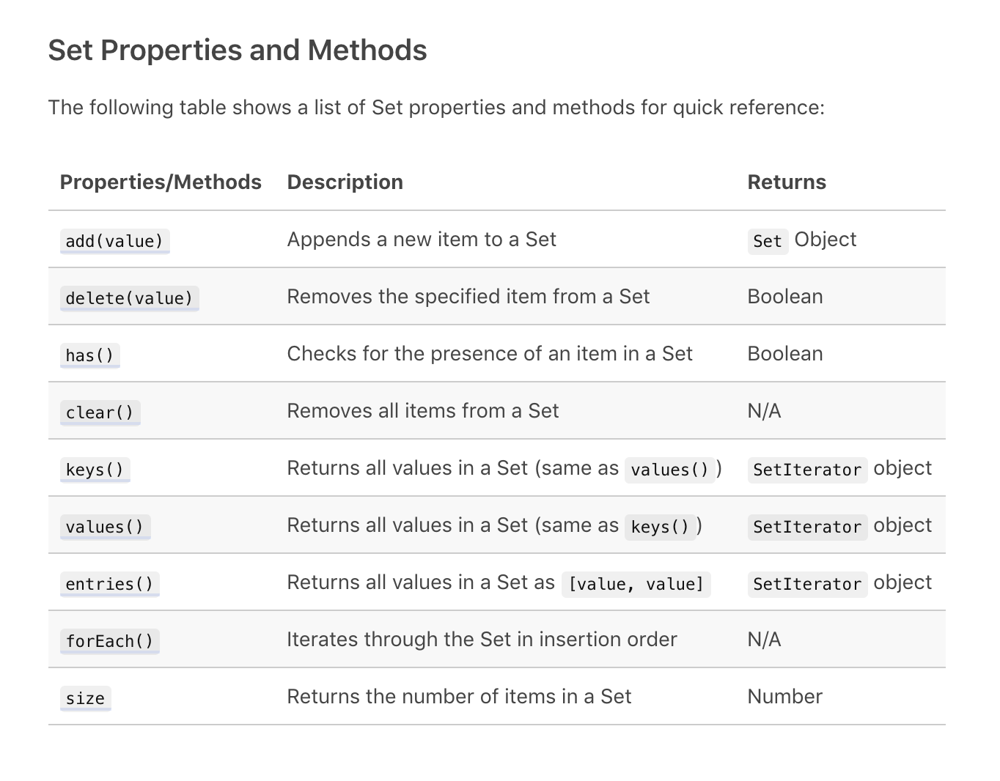

# 2/22/20 Saturday 

## Set 

A set is a collection of unique values. A set is more conceptually similar to an array, than an object. 

### When should we use Set?

- Working with duplicated values in data
- Can be used to find the union, intersection, and difference between two sets of data

