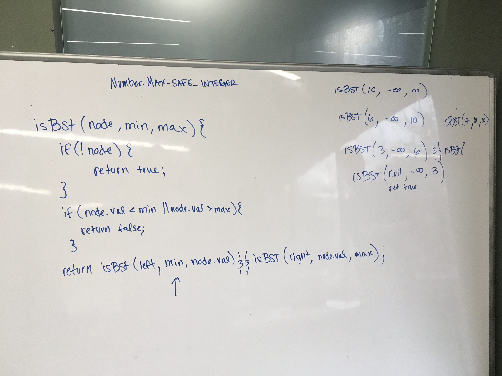
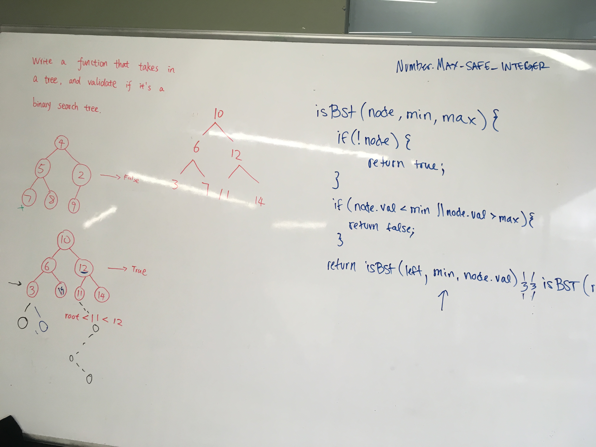
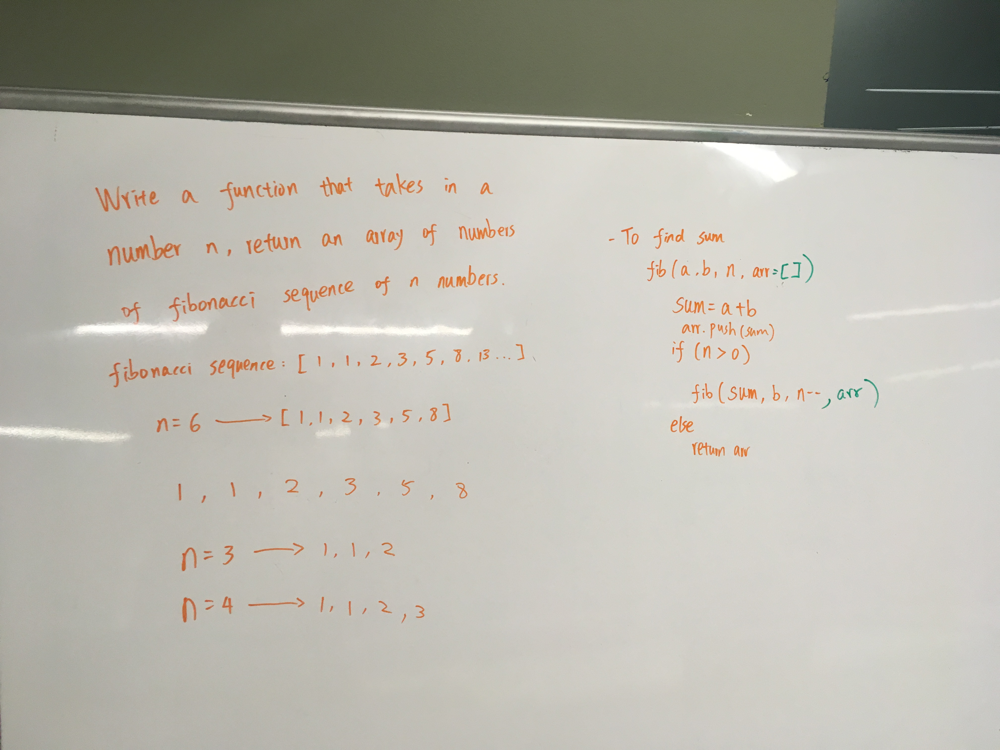

# 2/3/20 Monday

Today I practiced some whiteboarding on recursion with my friends at school.

Validating if a binary tree is a BST

Fibonacci problem

Started on my [portfolio project](https://github.com/dzheng24/react-portfolio) today, using react. 

Tonight I went to an introductory course to Python at Galvanize. This is the Google Colab file that we used:

https://colab.research.google.com/drive/1ww5pQseOYP1cvHQJ8HFZW9tiPY-yywjp