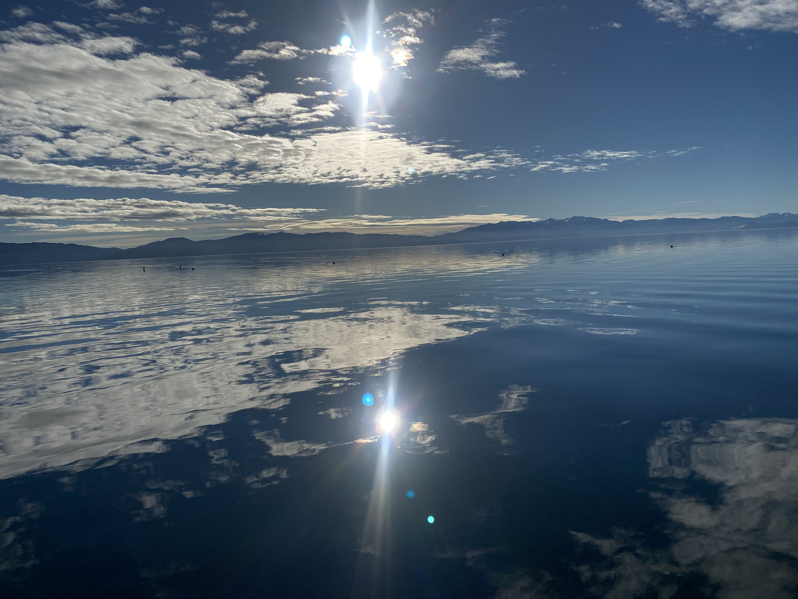

# 1/26/20 Sunday

Kobe's passing hit me like a ton of bricks. My sister texted me the tragic news as I was getting seated on my connection flight in San Fran. I used to be obsessed with NBA; the reason I like to play basketball is because of Kobe Bryant. As a young boy growing up in China, I remember watching him compete, and hearing the announcer emphatically yelling in one game: "Kobe is shooting further and further!" (I think this was the game when he made 12 3s). NBA broadcasts were scarce back then, our family friend would come over just to watch Kobe...

Rest in peace, Kobe, Gianna, and all the victims in this tragedy. 

Warmest thoughts and prayers to all the victims' families. 

Picture of Lake Tahoe taken by my friend Ashley over the weekend. 

Thank you for reading.

