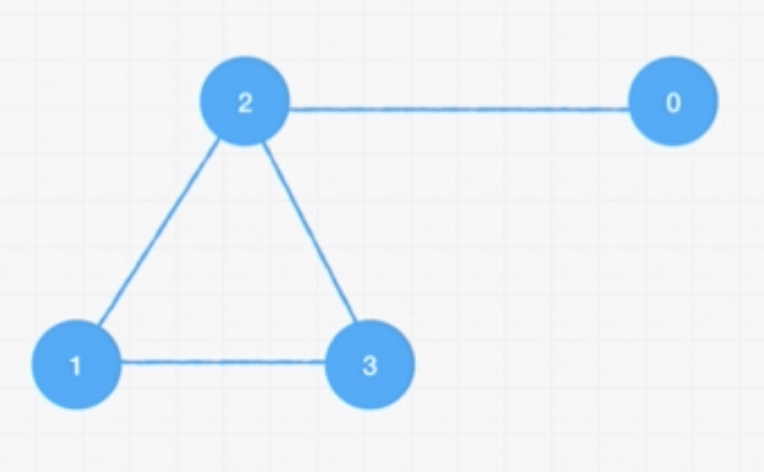

# 3/26/20 Thursday

I had my first behavioral interview with Apprenti today. Some takeaways:
  - While it is good to be concise, it is important to paint the context for the interviewer when describing the situation.
  - Be more specific in examples, "What I mean by 'accountability' may be fundamentally different from yours". 
  - Avoid focusing too much on one single transferable skill. 

Began learning graphs today, will continue tomorrow. Shout out to all the health care workers working on the front lines. 

## Example of graph implementation:


```js
// Edge List
const graph = [[0, 2], [2, 3], [2, 1], [1, 3]];

// Adjacent List 
// Index is the node; values are the neighbors
const graph = [[2], [2, 3], [0, 1, 3], [1, 2]];

// Adjacent Matrix
// Contains 0s and 1s that indicate whether the node x has connection to node y
const graph = [
  [0, 0, 1, 0],
  [0, 0, 1, 1],
  [1, 1, 0, 1],
  [0, 1, 1, 0]
]
```